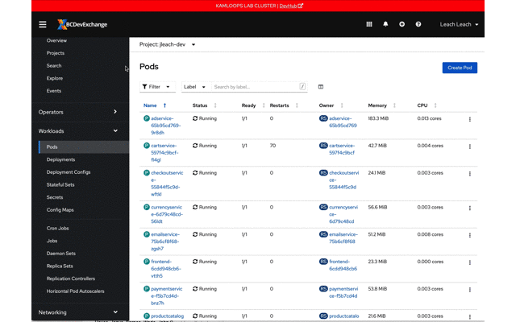

# TL;DR

The Hipster Store (HS) is a sample project created by Google to illustrate a microservices architecture designed to run on [Kubernetes](Kubernetes.io) (k8s). The HS makes for a great teaching application for Network Policy (NP) for a few reasons: its has lots of components with specific communication paths; its a working application; and its well documented.

# Introduction

This project was created to show off some best practices for labeling your application, components, routes, and network security policy (NP). Labeling is is key to both a healthy easy to manage application as well as implementing meaningful custom NP.

As part of this demo project the HS application was converted to work on the OpenShift Container Platform (OCP) and custom NP was created to only allow components talk to the other as needed to preform their job, according to the [Service Architecture](https://github.com/GoogleCloudPlatform/microservices-demo#service-architecture). 

# Labels

Labels allow specific infrastructure components like routes or deployments as well as workload like pods to be grouped or uniquely identified. In the HS application they are used both to group (for management) and identify for NP.

## Application Identity

Its often useful to group things or all the things in your application for quick and easy management. For example, it a `dev` environment it may be useful to delete all resources so that subsequent deployments can start with a clean slate.

To do this, add labels to each `kind:` of object in your deployment manifest. In the hipster shop example the label `app: hipster-store` is added.

```yaml
- apiVersion: apps/v1
  kind: Deployment
  metadata:
    name: emailservice
    labels:
      app: hipster-store
  spec:
```

This allows all components to be removed with a single command:

```console
oc delete all -l "app=hipster-shop"
```

## Component Identity

The second way labels are used are to uniquely identity workload. This is done by adding labels to the `template` section of the deployment manifest. These labels will be unique to running pods created from the deployment. It makes it easy to manage network communication by grouping pods, regardless of how many there are, and applying `netpol` uniformly. In the HS example the `role:` label is used:

```yaml
template:
  metadata:
  labels:
    app: hipster-store
    role: emailservice
```

This results in unique identifying a component by its role within OCP as seen by the following animation:




# The Laboratory

This section will take you through assigning a role to each microservices and writing the associated network policy to allow them to communicate among themselves.


# Run & Go

This sections is meant for to deploy-and-go. You won't learn much doing this other that have a working sample application you can review. The following steps (commands) will deploy the following components:

1. Hipster Store Application
2. Custom Policy
3. Load Generate

## Deploy It

### Step 1: Pre-Flight Check

Before you deploy this application you should remove any `quick start` policy created automatically or otherwise. To check if you have quick start policy run the following command:

```console
oc get netpol
```

The two policies `allow-same-namespace` and `allow-from-openshift-ingress` can be deleted while the third cannot. Its owned by a platform services bot and will be re-created if deleted. 

```console
NAME                                           POD-SELECTOR   AGE
platform-services-controlled-deny-by-default   <none>         22h
allow-same-namespace                                          6m
allow-from-openshift-ingress                                  6m
```

Delete them with the following command:

```console
oc delete netpol allow-same-namespace allow-from-openshift-ingress
```

If you ever want to re-deploy the quick start policy you can find it and the instructions [here](https://github.com/bcgov/how-to-workshops/tree/master/labs/netpol-quickstart).


### Step 2: Deploy the Security Policy

In order for PUs to deploy they need to be able to communicate with the k8s API. We'll go ahead and deploy our NSP first because it contains the policy to allow this to happen. We could deploy the applications first but we'll see lots of `CrashLoopBackOff` messages as PU's health checks and k8s API communications fail.

```console
oc process -f openshift/app-netpol -p NAMESPACE=$(oc project --short=true) \
| oc apply -f -
```

As mentioned above this allows PUs to communicate acording to the [Service Architecture](https://github.com/GoogleCloudPlatform/microservices-demo#service-architecture).


**ProTip 🤓**

The `NAMESPACE` parameter is required because your policy will be applied to an Aporeto namespace that matches your OCP namespace. It will signal to Aporeto the scope of your policy.

### Step 3: Deploy the Application

Now deploy the application and components. This will spin up several pods and create a route you can use to test the application.

```console
oc process -f openshift/app.yaml| oc apply -f -
```

Wait for all the pods to start; they will have a "READY" count of `1/1` as shown by the command `oc get pods`. Once all pods have `1/1` in the READY state you can test the application by loading the route in your browser.

### Step 4: Deploy the Load Generator

The HS comes with a sample load generator. This is great for debugging NSP because it will generate traffic across all the components. The `loadgen.yaml` manifest contains its own NSP which is why the `NAMESPACE` parameter is required.

```console
oc process -f openshift/loadgen.yaml -p NAMESPACE=$(oc project --short=true) | \
oc apply -f -
```

You can now access your namespace via the Aporeto console and see the communication paths of the components. Green arrows mean all is well; orange mean something was not working but is now fixed; red indicates communication is failing. The direction of the arrow shows source to destination.


## Cleanup

Use the label `app=hipster-store` to cleanup all deployments, pods, routes and NSP associated with the HS in one easy step:

```console
oc delete all,nsp -l "app=hipster-store"
```

# Contributing

This project is released with a [Contributor Code of Conduct](CODE_OF_CONDUCT.md). By participating in this project you agree to abide by its terms.

# References

Find the original Hipster Store [here](https://github.com/GoogleCloudPlatform/microservices-demo) on GitHub.

The Hipster Store Service Architecture, which defines the communication patterns of the application, can be found [here](https://github.com/GoogleCloudPlatform/microservices-demo#service-architecture).

Much of the application deployment manifests are taken directly from the k8s manifests supplied by Google. That source is Copyright 2018 Google LLC.
