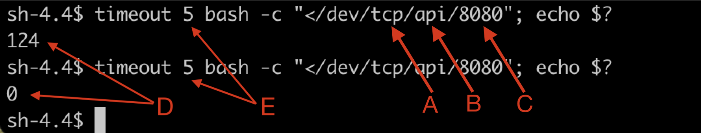

Getting started with Kubernetes Network Policies In Openshift

This lab contains the quick start material that will get your environment up and running with the KNP.

* [OpenShift SDN](https://docs.openshift.com/container-platform/4.6/networking/openshift_sdn/about-openshift-sdn.html)

* [OpenShift NetworkPolicy](https://docs.openshift.com/container-platform/4.6/networking/network_policy/about-network-policy.html#about-network-policy)

* [Kubernetes NetworkPolicy](https://kubernetes.io/docs/concepts/services-networking/network-policies/)

# Prologue

 Back in 2019 we decided to take a strong stance on security and, by way of a security focused project, began implementing several tools to make our OpenShift Container Platform (OCP) a leader in this respect. Openshift 4 Build-In Software Defined Network (SDN) has been implemented to control network security for all apps hosted on the Private Cloud Openshift Platform. 

# Introduction

Developers interact with the Openshift 4 Build-In SDN through the use of Kubernetes Network Policies (KNPs) objects that allow to specify network security rule declaratively within each namespace and down to the pod level. **All projects first provisioned on the Platform have "Zero-Trust" network security enabled by default** which means that all communications from and within the project namespaces are shutdown except for those that are explicitely allows in the KNPs.  This guide will walk you through implementing the quick start Network Policy (KNP) to unblock basic communications within a namespace. While this will be enough to your project up-and-running we **strongly** recommend rolling out more robust NPs to ensure your environment(s) are as secure as they can be. Further workshops will expand on this subject. 

Read more about [the KNPs features](https://docs.openshift.com/container-platform/4.8/networking/network_policy/about-network-policy.html) supported in the current version of the OpenShift (v4.8) on the Platform. Note that the support for egress rules and ipBlock rules have only become available in OCP 4.8.

# Getting Started

Before we dive into the quick start policies, lets go over a few important details:

### Egress Rules

With the quick start KNP in place pods will be able to connect to other pods within their namespace, in other namespaces, or to external systems (outside of the cluster). 

Without egress policy, pods that need to communicate **between namespaces** only require ingress rules on the destination pod to permit the inbound communication. This is fine is most circumstances because you will have a *deny-by-default* rule guarding all your namespaces.

High security projects that require egress rules to a specific namespace should reach out to Platform Services; these policies can be implemented, as needed, by a cluster administrator.

### Roll Out

As product teams implement network policy they are "rolling out" KNP; there is nothing Platform Services needs to do. Everything is in place and working as expected. 

One a KNP is installed in every namespaces provisioned by the Platform Project Registry and it cannot be removed; if you remove it a smart robot will just re-create it a few moments later.

```console
➜  how-to-workshops git:(master) ✗ oc get netpol
NAME                                           POD-SELECTOR   AGE
platform-services-controlled-deny-by-default   <none>         57d
```

By adding this policy to a namespace PS effectively enables KNP for that namespace.

## Quick Start

The quick start policy builds on top of the existing `platform-services-controlled-deny-by-default ` by adding two rules that:

1. Allow your routes to work by permitting traffic from the OpenShift HAProxy routers into your namespace (ingress);
2. Allow pods in the same namespace to communicate.

Lets review the thee policies in more detail.


### Walled Garden

First, the PS added policy `platform-services-controlled-deny-by-default` isolate the namespace creating a walled garden. Nothing will be able to talk to the pods inside and the pods inside won't be able to talk to one another:

```yaml
- kind: NetworkPolicy
  apiVersion: networking.k8s.io/v1
  metadata:
    name: platform-services-controlled-deny-by-default
  spec:
    # The default posture for a security first namespace is to
    # deny all traffic. If not added this rule will be added
    # by Platform Services during environment cut-over.
    podSelector: {}
    ingress: []
```

### Ingress

Having a route alone isn't enough to let traffic flow into your pods, you also need a policy to specifically allow this. This will be the first custom policy added to your namespaces. Once in place, any pod with an external route will receive traffic on said route.

```yaml
- apiVersion: networking.k8s.io/v1
  kind: NetworkPolicy
  metadata:
    name: allow-from-openshift-ingress
  spec:
    # This policy allows any pod with a route & service combination
    # to accept traffic from the OpenShift router pods. This is
    # required for things outside of OpenShift (like the Internet)
    # to reach your pods.
    ingress:
      - from:
          - namespaceSelector:
              matchLabels:
                network.openshift.io/policy-group: ingress
    podSelector: {}
    policyTypes:
      - Ingress
```

**Pro Tip 🤓**
- Add labels to your KNP to easily find and delete them as a group. Check out [this sample application](https://github.com/bcgov/how-to-workshops/blob/master/labs/netpol-demo-project) that demonstrates the use of labels to make it easier to apply KNPs to the selected pods.
- `podSelector: {}` is a wildcard, if you want additional piece of mind add a label like `route-ingress: true` to pods that can accept external traffic and use it in place of the wildcard.

### Any to Any

Allowing pods to accept traffic from a route is great, and maybe that's enough for some projects, but most will have APIs and databases that need to communicate. This is done by adding another rule permitting all pods within a namespace to communicate.

```yaml
- kind: NetworkPolicy
  apiVersion: networking.k8s.io/v1
  metadata:
    name: allow-same-namespace
  spec:
    # Allow all pods within the current namespace to communicate
    # to one another.
    podSelector:
    ingress:
    - from:
      - podSelector: {}
```

**Pro Tip 🤓**
- Add labels to your KNP to easily find and delete them as a group.
- Additional labs will cover writing targeted KNP so that, for example, only the API pod can talk to a database pod.


## Quick Start

There is an OCP template called [QuickStart](./quickstart.yaml) at the root level of this lab. Its adds the two policy described above Before you run the quick start template, consider examining existing KNP and removing any redundant policy; it will make debugging easier in the future.

```console
oc get netpol
```

When you are ready to apply the quick start policy above run the following command passing in the two required parameters described below:

```console
oc process -f quickstart.yaml \
 -p NAMESPACE=<NAMESPACE_NAME_HERE> | \
 oc apply -f -
```

| Parameter    | Description         |
| :----------- | :------------------ |
| NAMESPACE    | The namespace you are deploying this policy to. |

Here is what the command should look like when run:

```console
➜  netpol-quickstart git:(main) ✗ oc process -f quickstart.yaml NAMESPACE -p $(oc project --short) | oc apply -f -
networkpolicy.networking.k8s.io/allow-same-namespace created
networkpolicy.networking.k8s.io/allow-all-internal created
```

That's it. While you're technically done it is **highly** recommended teams write custom policy that deliberately controls how pods communicate. To learn more about this keep reading...

**Pro Tip 🤓**

- Use `oc get netpol` or the OpenShift Web Console to view your newly minted policy;

## Testing

Test connectivity by opening a remote shell `oc rsh pod-name-here` to each pod then use the simple shell command shown below:

```console
timeout 5 bash -c "</dev/tcp/api/8080"; echo $?
```




| Item | Description |
| :--- | :---------- |
| A    | The protocol to use, `tcp` or `udp` |
| B    | The `service` or pod name as shown by `oc get service` or `oc get pods` |
| C    | The port number exposed by the Pod |
| D    | The return code of the command: `0` means the pods can communicate, while `124` means the pods cannot communicate on the given protocol / port |
| E    | The delay in seconds the command will wait before failing |

## Need More Help?

If you need more help after reading this please ask questions in the `#devops-how-to` or do a quick search through [these issues](https://github.com/BCDevOps/OpenShift4-Migration/issues) in our OCP4 migration Q&A repo.
